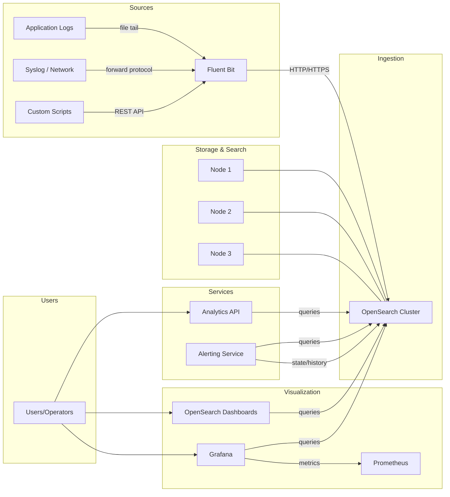
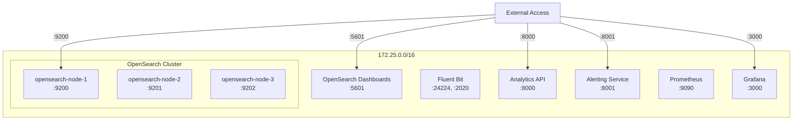
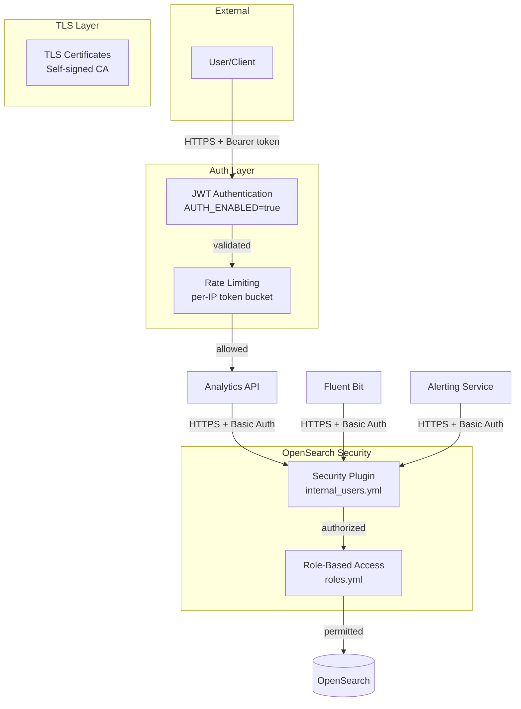
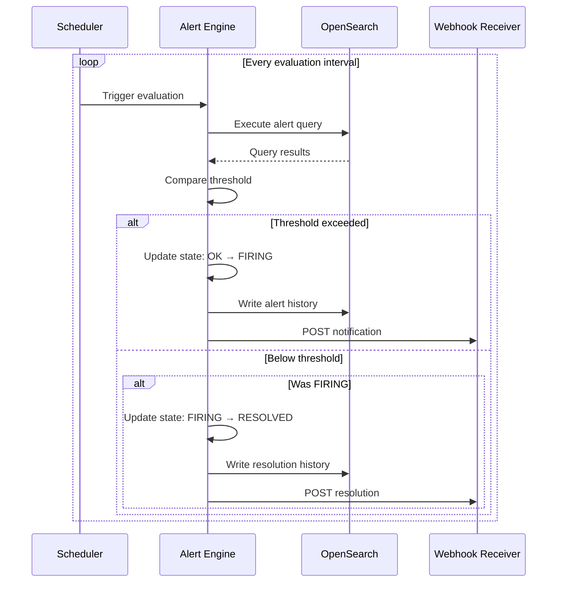

# System Architecture Diagrams

Visual documentation of the Vaultize Analytics Platform architecture.

## Data Flow



## Network Architecture



## Security Architecture



## Alerting Pipeline



## Deployment Modes

### Development Mode (Default)

```
docker compose up -d
```

- Security plugin: **disabled**
- Authentication: **disabled**
- CORS: **allow all**
- TLS: **off**

### Secure Mode

```
bash scripts/ops/start_secure.sh
```

- Security plugin: **enabled**
- Authentication: **enabled** (JWT)
- CORS: **restricted**
- TLS: **on** (self-signed CA)

## Component Summary

| Component | Technology | Port | Purpose |
|-----------|-----------|------|---------|
| OpenSearch (x3) | OpenSearch 2.11.1 | 9200-9202 | Search & analytics engine |
| OpenSearch Dashboards | OSD 2.11.1 | 5601 | Visualization UI |
| Fluent Bit | Fluent Bit 2.2.0 | 24224, 2020 | Log ingestion |
| Analytics API | FastAPI (Python) | 8000 | REST API for search/agg |
| Alerting Service | FastAPI (Python) | 8001 | Alert evaluation & notification |
| Prometheus | Prometheus v2.48.1 | 9090 | Metrics collection (optional) |
| Grafana | Grafana 10.2.3 | 3000 | Unified dashboards (optional) |
